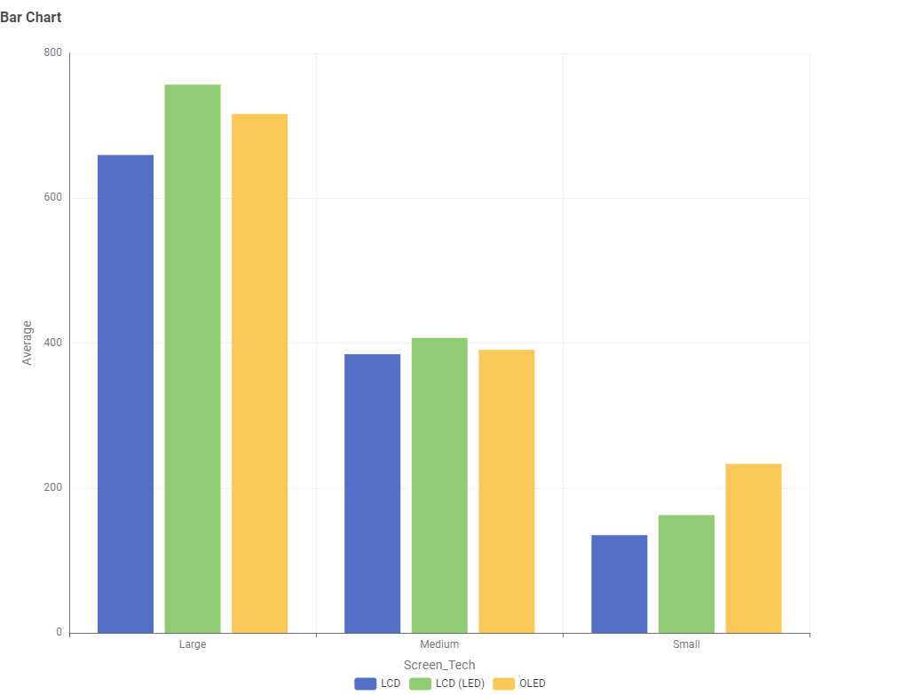
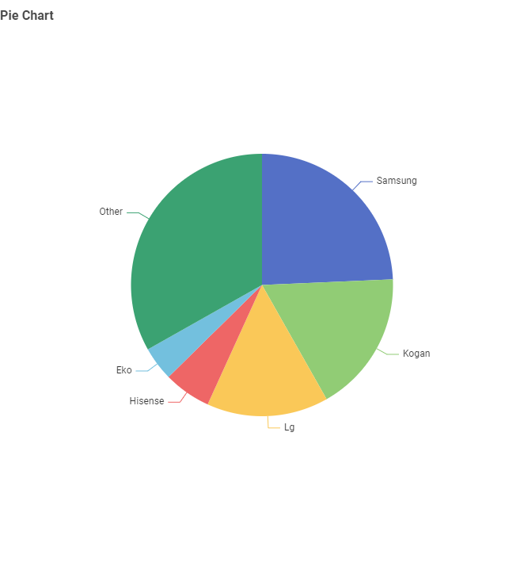
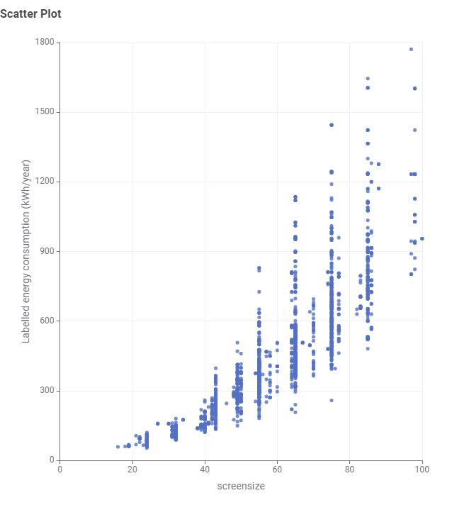

# TV Energy Consumption Data Story

## Data Story

### Audience
The target audience is Australian consumers who are planning to purchase a television. They are interested in understanding energy consumption, brand options, and how screen size affects electricity usage.

---

### Question 1: Which screen technologies are more frequent?

**Answer:**  
LCD and LED televisions are the most common technologies in the dataset, while OLED TVs appear less frequently. This is likely because LCD and LED TVs are cheaper to produce and more affordable for consumers. OLED TVs generally provide better picture quality, but they are more expensive, so fewer models are available.

---

### Question 2: Which TV brands are most common?

**Answer:**  
Samsung is the most dominant individual brand in the dataset. However, the “Other” category is even larger, which means many smaller brands together make up a large part of the market. This suggests that although a few major brands stand out, the TV market is still made up of many competing smaller brands.

---

### Question 3: How does screen size affect energy consumption?

**Answer:**  
The scatter plot shows a clear positive relationship between screen size and energy consumption. As screen size increases, energy usage also increases. This indicates that larger televisions consume more energy, making screen size one of the most important factors affecting electricity use.

---

## About the Data

### Data Source
The dataset is based on television energy consumption information available for the Australian market.

### Data Processing
The data was cleaned and transformed using KNIME. This included filtering relevant columns, cleaning text inconsistencies, grouping records, and preparing data for visualisation.

### Privacy
The dataset contains product information only and does not include any personal or sensitive user data.

### Accuracy and Limitations
The dataset may not represent the entire market and may change over time. Some results may also be affected by data cleaning decisions and grouping choices.

### Ethics
The analysis aims to present the data clearly and honestly without misleading interpretations or exaggeration.

---

## AI Declaration
AI tools were used to assist with structuring, wording, and formatting this report. All data analysis, chart creation, interpretation, and final decisions were completed by the student.